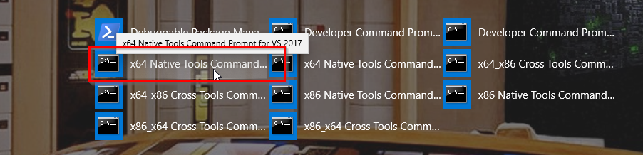

# Compile Python to Binaries

Here we show how to compile Python code to binaries. To compile the entire 
application to an executable using PyInstaller is discussed in
[Compile and Package](https://github.com/psilons/pypigeonhole-proj-tmplt/tree/master/sample-proj-cmpl).

In this case, PyInstaller is mainly a packager. It collectes all needed 
components into a file or a folder so that we don't need Python SDK to
run the app. The executable is self contained. Upon startup, it unpacks
components and runs.

What we discuss here is to compile part of Python code using Cython.
Hopefully, the compiled lib boosts performance.


## Library Cython Build

```cd <root path>\python-compile2bin\my-lib```

```conda env create -f environment.yml```

```conda activate py385_c2b_my_lib```

```python setup.py build_ext```

The output is in build\lib.win-amd64-3.8

```python setup.py bdist_wheel```

The output is in dist folder. The wheel file is referred in the environment.yml below.

## Application Builds

```cd <root path>\python-compile2bin\my-app```

```conda env create -f environment.yml```

```conda list | grep my-lib```

```conda activate py385_c2b_my_app```

Another way to install my-lib:

```pip install ..\my-lib\dist\my_lib-0.0.0-cp38-cp38-win_amd64.whl```

Now test the app in IDE, it should work fine.

#### PyInstaller Build

```pyinstaller_build.bat```

The output is in dist, we can run the executable from the command line.

We need to tell PyInstaller where to scan the imports:
```
--paths=src\game_tests
```
Furthermore, we need to tell PyInstaller to scan submodules not in the above
folders but used download the road:
```
--hidden-import games.stack_queue_impl
```
Otherwise, we would get no module found error. This adds more work for dev to
track down all imports in submodules.

Another way is to run ```python setup.py bdist_wheel``` to generate a wheel file.

## Nuitka

```cd <root path>\python-compile2bin\nuitka_test```

```conda env create -f environment.yml```

```cd src```  we have to go into src, otherwise NoModuleFoundError

open an MSVC window: 
How to not rely on this step? Here is the MSVC installation folder:
C:\Program Files (x86)\Microsoft Visual Studio\2017\Community\VC\Tools\MSVC\14.15.26726\bin\Hostx64\x64


go to src folder and activate conda environment. Then run

```python -m nuitka --follow-import-to=my_app my_app\klotski_app.py```

This generates the executable in the current folder.


## Performance

(Absolute numbers are less meaningful, depend on hardware and OS. So relative
numbers are more meaningful.)

Python takes about 7 seconds.

Cython with Python caller takes about 3.3 seconds, so double the performance.

PyInstaller executable takes about 6 seconds.

Nuitka takes 7.2 seconds

This is a small app, so load time doesn't much difference between one-file or folder.


## Cython

This is a simple test without 3rd party libraries. Whether this approach works with
other libraries is a trial-and-error.

Cython also can be used to bridge C/C++ code. Another option is SWIG.

There are several catches in Cython:
<ul>
    <li>
        Cannot compile several python files/modules into one shared lib. 
        Ideally, we want to compile a folder/component into one shared lib.
		Compiling large number of python files is tedious.
    </li>
    <li>
        We need to specify build_dir="build" in order to keep source folder
        clean and move all generated artifacts to build folder.
    </li>
    <li>
        The build generates .pyd on windows and .so on linux, with proper name
        specified in the Extension name field  + Cython version and OS info.
    </li>
</ul>

## Other options

cxfreeze
